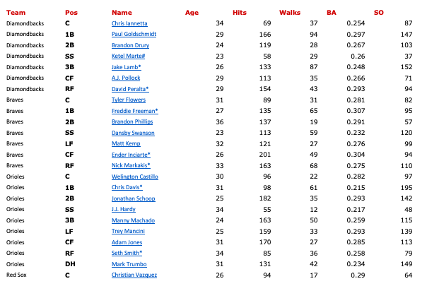
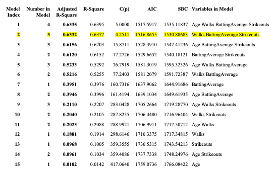
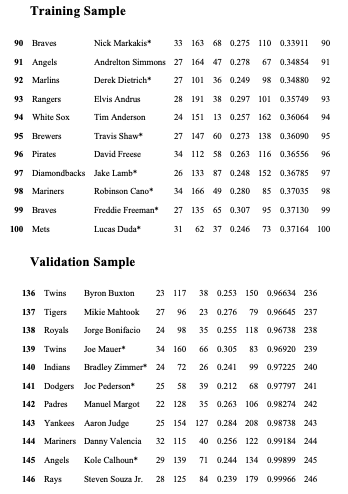

# Predictors on the Productivity of Hits in 2017 Major League Baseball

## Table of contents
* [A Multiple Regression Analysis of Batting Average and Hits](#A-Multiple-Regression-Analysis-of-Batting-Average-and-Hits)
	- [Introduction](#Intoduction)
	- [Data Source](#Data-Source)
	- [Variables](#Variables)
* [A Simple Regression Model](#A-Simple-Regression-Model)
	- [Scatterplot](#Scatterplot)
	- [The Linear Regression Model](#The-Linear-Regression-Model)
	- [SAS Output for the Fitted Model](#SAS-Outplot-for-the-Fitted-Model)
	- [Analysis of Outplot](#Analysis-of-Output)
* [Model Selection](#Model-Selection)
	- [Best Subsets Model Selection](#Best-Subsets-Model-Selection)
	- [Forward Stepwise Model Selection](#Forward-Stepwise-Model-Selection)
	- [Cook's D](#Cooks-D)
	- [Variance Inflation](#Variance-Inflation)
* [Cross Validation](#Cross-Validation)
	- [Model Selection with GLMSelect](#Model-Selection-with-GLMSelect)
	- [Quality of the Fitted Model: Steps for Cross Validation](#Quality-of-the-Fitted-Model-Steps-for-Cross-Validation)

## A Multiple Regression Analysis of Batting Average and Hits

### Introduction
The topic of this subject matter is on the starting lineup for all teams in the 2017 MLB season. I’ve been a baseball fan, specifically of the Yankees, since around 10 years old. I would watch the games with my family and we would cause so much commotion that my mother would think something bad had happened. I became such a giant fan of the Yankees throughout the years that I even got season tickets. Admittingly, I started to grow tired of baseball after that year, maybe it was all the travelling to the Bronx that I had to do, but in recent years my interest has started to slowly grow back. Therefore, for this analysis I’m interested in seeing how specific variables affect hits.

### Data Source
I was able to pull up the statistic for the starting lineup for 2017 of all Major League Baseball Teams on the following website:
https://www.baseball-reference.com/leagues/MLB/2017.shtml

### Variables
There are a total of 246 observations in this dataset. For this analysis the dependent variable is the total number of hits for each player and the independent variables are batting average, age, strikeouts, and at bats.

Hits: When the batter safely reaches first base after hitting the ball in fair territory

Batting Average: Number of hits divided by at bats

Age: Age of the batter

Strikeouts: Occurs when the batter racks up 3 strikes for failure to hit the ball into fair territory

Walks: occurs when a batter receives four pitches outside the strike zone and is in turn awarded first base

## A Simple Regression Model
### Scatterplot

I don’t see obvious curvature in my data. We can see a bit of heteroscedasticity towards the bottom of the scatterplot. The pink line illustrates the vertical cut in the data. It could be that these players didn’t play a full season due to an injury or they might have just had a very bad year. No real leverage or outliers exist in this scatterplot. The two points that are separated by the pink line fall in line with the rest of the data and aren’t dramatically far away from the rest of the data points.

### The Linear Regression Model

Yx= &beta;o + &beta;1x + &epsilon;

(a)	Yx = subpopulation average, which is normally distributed, of hits that share the same batting average.

(b)	E(Yx) = the expected value of the random variable, Hits, conditional on knowing the batting average. For example, it is the expected value of the subpopulation average of hits given all the players with 0.250 batting average. 

(c)	V(Yx) = the variance of the random variable hits given the players with a batting average of 0.250.

### SAS Output for the Fitted Model
   
At a given count of x, say in my case is a batting average of 0.250, we can picture a vertical line down that count, illustrated in green. That vertical line intersects the 2 dotted lines. The y coordinates of those intersections, illustrated by the purple dots, define the endpoints for the 95% prediction interval for the number of hits of the 247th (the next observation) player. As the vertical line passes through the shaded band, given by the pink slanted lines, it defines the 95% confidence interval for the subpopulation expected value of hits given a batting average of 0.250. Where the vertical line intersects the  line, the red dot, it gives us the point prediction of the number of hits of the 247th player with a batting average of 0.250.

### Analysis of Output

#### The t-test
 
i. We are testing if the population slope for hits and batting average is equal to zero.

ho = &beta;1 =0
	
ho = &beta;1 ≠ 0
	
ii. Test statistic: t-stat =  (b1 - &beta;1/(s/√SSx)  =  (760.15209-0)/59.89739=12.69
	
Rejection Region: |12.69| > 1.970, &alpha;=0.05

t-critcal value with 2 d.f. = 1.970

Conclusion :	null hypothesis is rejected because the |t-stat| = |12.69| greater than the t-critical value of 1.970

#### The yhat equation

The equation for the fitted model is as follows:

yhat = -79.721 + 760.152x

## Model Selection

### Best Subsets Model Selection

I tried taking log and square root transformations, but I didn’t notice any obvious improvements in the data. In the scatterplot showing Hits and Age, I don’t see an obvious relationship. It seems to be negatively correlated but it isn’t a very strong one. In the scatterplot showing Hits vs. Walks there are a couple of leverage points which I have circled in purple. They lie a bit far in the horizontal direction, away from the rest of the data.

 

The model I prefer includes Walks, Batting Average and Strikeouts. C(p), AIC, BIC, and SBC, all agree that a model with 4 parameters is best, which means the model has 3 regressors. Next to the star aligned with the 4 parameters, a 2 is shown. Therefore, looking at the Summary Table above Model number 2 shows that the best model includes, Walks, Batting Average, and Strikeouts.

### Forward Stepwise Model Selection

According to the summary of the Stepwise Model Selection, the first variable selected was Batting Average. Then it added Strikeouts and did not remove Batting Average. Next, it added Walks and did not remove any of the previous variables. Finally, the selection method stopped and did not add the last variable which is Age.

  
The Stepwise Selection method choose the same model as the best subsets method. 

### Cook's D

Below are the diagnostic plots for the model selected above. The plots show the flagged players according to Cook’s D and Outlier and Leverage Plot. Aaron Judge seems to be the most obvious influential point according to both diagnostic plots. 

 

### Variance Inflation

Variance Inflation, shows if multicollinearity exists in our analysis. If the VIF is high, the variance of the standard errors of the slope is increased because of collinearity. It helps us identify if we are regressing one variable on another almost identical to itself. All variables are close to 1, therefore multivollinearity does not exist.

## Cross-Validation

### Model Selection with GLMSelect

I used Proc GLMSelect in SAS, with AICC as a selection criterion. The first variable selected was Batting Average, then it chose Strikeouts, next it chose Walks. The bold line at 3 indicates that those three variables are the best model for Hits. 

### Quality of the Fitted Model: Steps for Cross Validation

I used Cross Validation to judge the quality of the fitted model shown above. 
	
*Step 1: Splitting the Data*

The first step I took was to split the existing data into two groups. I did this by first randomizing the order of the 246 batters in my data, and then I split them into two groups. The first group, known as the training group, consists of 100 batters and the second group, known as the validation group, consists on 146 batters. 

*Step 2: Fit the Regression Model*

Now I fit the regression model on the training sample.

Obs	b0	     b1	        b2	b3	  IntMSE  
1	-179.334     892.943	0.46401	0.34825	  389.806

*Step 3: Out of Sample Forecasting*

Next, I used the resulting  equation to forecast the number of hits for the Validation Sample. Below, I have shown the last 10 observations of the yhat equation Validation Sample.

*Step 4: Compare MSE values*

In order to measure the quality of fit, we need to compare the Internal MSE (MSE for the training sample) with the External MSE (MSE for the validation sample). If the training MSE and the validation MSE are similar in value, then we can say that this is evidence for validating the chosen model. 

Obs	_TYPE_	_FREQ_	IntMSE	ExtMSE  
1	0	146	389.806	539.500

Since, the slope estimates are computed in such a fashion as to minimize the Internal MSE, we must expect that the External MSE will be larger than the Internal MSE. We can use the following equation to account for how much larger the External MSE will be from the internal MSE:

((n+p))/((n-p))=  ((246+4))/((246-4))=  250/242=1.033

Now, I can compare that with the Internal and External MSE:

(External MSE)/(Internal MSE)=  539.5/389.806=1.384
		
They seem to be close in value, therefore the model has been validated.
