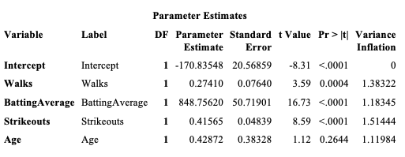

# Predictors on the Productivity of Hits in 2017 Major League Baseball
Hits in MLB Prediction Project
## Table of contents
* [A Multiple Regression Analysis of Batting Average and Hits](#A-Multiple-Regression-Analysis-of-Batting-Average-and-Hits)
* [A Simple Regression Model](#A-Simple-Regression-Model)
* [Matrix Methods](#Matrix-Methods)
* [Model Selection](#Model-Selection)
* [Cross Validation](#Cross-Validation)

## A Multiple Regression Analysis of Batting Average and Hits
### Introduction
The topic of this subject matter is on the starting lineup for all teams in the 2017 MLB season. I’ve been a baseball fan, specifically of the Yankees, since around 10 years old. I would watch the games with my family and we would cause so much commotion that my mother would think something bad had happened. I became such a giant fan of the Yankees throughout the years that I even got season tickets. Admittingly, I started to grow tired of baseball after that year, maybe it was all the travelling to the Bronx that I had to do, but in recent years my interest has started to slowly grow back. Therefore, for this analysis I’m interested in seeing how specific variables affect hits.
### Data Source
I was able to pull up the statistic for the starting lineup for 2017 of all Major League Baseball Teams on the following website:
https://www.baseball-reference.com/leagues/MLB/2017.shtml

### Variables
There are a total of 246 observations in this dataset. For this analysis the dependent variable is the total number of hits for each player and the independent variables are batting average, age, strikeouts, and at bats.

Hits: When the batter safely reaches first base after hitting the ball in fair territory

Batting Average: Number of hits divided by at bats

Age: Age of the batter

Strikeouts: Occurs when the batter racks up 3 strikes for failure to hit the ball into fair territory

Walks: occurs when a batter receives four pitches outside the strike zone and is in turn awarded first base

## A Simple Regression Model
### Scatterplot

## Analysis of Scatterplot
I don’t see obvious curvature in my data. We can see a bit of heteroscedasticity towards the bottom of the scatterplot. The pink line illustrates the vertical cut in the data. It could be that these players didn’t play a full season due to an injury or they might have just had a very bad year. No real leverage or outliers exist in this scatterplot. The two points that are separated by the pink line fall in line with the rest of the data and aren’t dramatically far away from the rest of the data points.

## The Linear Regression Model

Yx= &beta;o + &beta;1x + &epsilon;

(a)	Yx = subpopulation average, which is normally distributed, of hits that share the same batting average.

(b)	E(Yx) = the expected value of the random variable, Hits, conditional on knowing the batting average. For example, it is the expected value of the subpopulation average of hits given all the players with 0.250 batting average. 

(c)	V(Yx) = the variance of the random variable hits given the players with a batting average of 0.250.

## Dataset
The dataset can be found here:
 
https://archive.ics.uci.edu/ml/datasets/wine+quality 
 
The data includes 1,599 observations and the following variables: 
 
**fixed acidity:** The predominant fixed acids found in wines are tartaric, malic, citric, and succinic. Wines produced from cool climate grapes are high in acidity and thus taste sour. These high-acid wines can be treated to reduce the acidity.
 
**volatile acidity:** Acetic acid, which is also the primary acid associated with the smell and taste of vinegar.
 
**citric acid:** An acid supplement during the fermentation process to help winemakers boost the acidity of their wine especially grapes grown in warmer climates.
 
**residual sugar:** Natural grape sugars leftover in a wine after the alcoholic fermentation finishes.
 
**chlorides:** Contributes to potential salty taste in wine.
 
**free sulfur dioxide:** Measure of the amount of SO2 that is not bound to other molecules. Sulfur Dioxide is used throughout all stages of the winemaking process to prevent oxidation and microbial growth.
 
**total sulfur dioxide:** The portion of SO2 that is free in the wine plus the portion that is bound to other chemicals in the wine such as aldehydes, pigments, or sugars.
 
**density:** Density of wine is primarily determined by the concentration of alcohol, sugar, glycerol, and other dissolved solids.
 
**pH:** Way to measure ripeness in relation to acidity.
 
**sulphates:** Food preservative widely used in winemaking in order to maintain the flavor and freshness.
 
**alcohol:** The amount of alcohol the wine contains.
 
**quality:** How the wine is rated. In this dataset the lowest quality is 3 while the highest is 8.

## Models Used
Linear Regression: Baseline Model
 
KNN
 
Random Forest

## Methodology
1. *Data Understanding and Data Cleaning:* Lengths and types of the variables were determined and data was checked for missing values. The dataset consists of all numeric variables. The dataset doesn't contain missing values.

2. *Exploratory Analysis:* Created visualizations to explore the target variable and examine the potential existance of outliers or corrupt data. Further visualized the relationship between the target and the feature variables and relationships between features. 

First, I examined the target variable, quality. The average of wines in this dataset are rated 5 or 6 and target variable is normally distributed.
  

Second, a distribution plot and a box plot was created to examine the distribution of each feature and the interaction between feature and target respectively. 
  

Lastly, a heatmap was created to further examine the degree of correlation between varibles.
  

The highest positively correlated variables are:
* citric acid and fixed acidity
* density and fixed acidity
* alcohol and quality  

The highest negatively correlated variables are:
* citric acid and volatile acidity
* pH and fixed acidity
* pH and citric acidity
* denisty and alcohol  

3. *Feature Selection and Feature Engineering:* In order to access which features to use for the linear regression model, I reviewed the p-values for each feature in order to determine with features showed staistical significance. I applied backward elimination in order to select the best features for the model. The variance inflation factor shows that mulicollinearity does not exist in the model selected. For the random forest model, I applied binning to quality. Wines of quality 3-4 were considered as low, 5-6 were considered medium, and 7-8 were considered high quality.  
   

4. *Model Building and Evaluation:* Established a baseline model and developed two additional models to see if I could improve upon the baseline. For each model a train-test split of 70%-30% was used. Each models were then fitted.  

### Baseline Model: Linear Regression
  
  *MSE:* .39  
  *R-squared:* 38%  
### KNN
  
  *MSE:* .44  
  *Accuracy:* 67%  
### Random Forest
   
  *MSE:* .18  
  *Accuracy:* 82%  

5. *Scoring the Dataset:* Evaluated the performance of each model based on MSE and R-squared/Accuracy. The model with lowest MSE and highest R-squared or Accuracy was selected for quality prediction.

## Model Results and Selection
**Random Forest gave the best prediction of quality with MSE of .18 and Accuracy of 82%.**
The distribution plot for the choosen model shows that the predicted values are very close to the actual values with a bit of an overestimation in the prediction of wines of "medium" quality and a slight underestimation in "low" and "high" quality wines.  
 
The plot below demostrates the level of importance of each feature on the quality of wine. The feature with the highest influence on quality is alcohol.  
 
